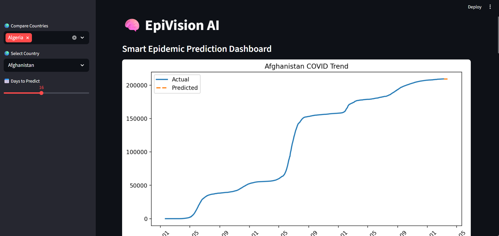
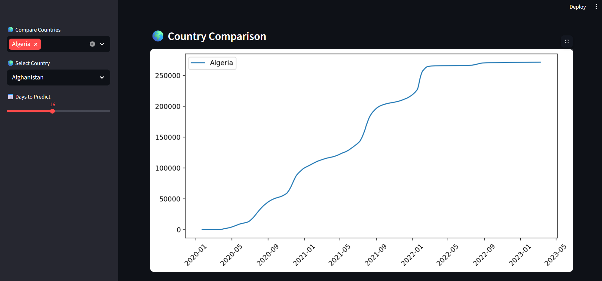
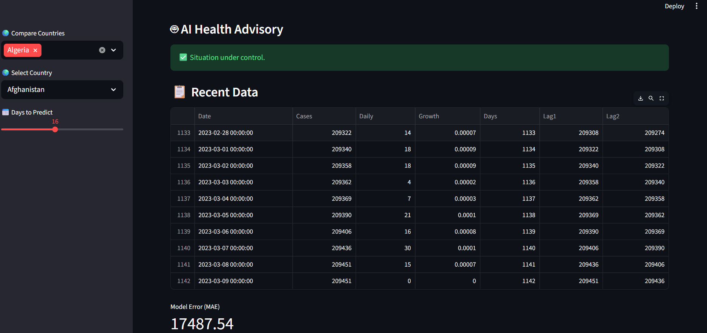
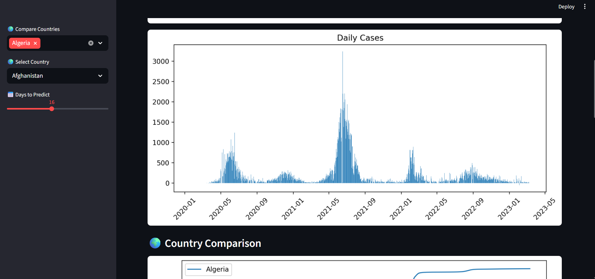
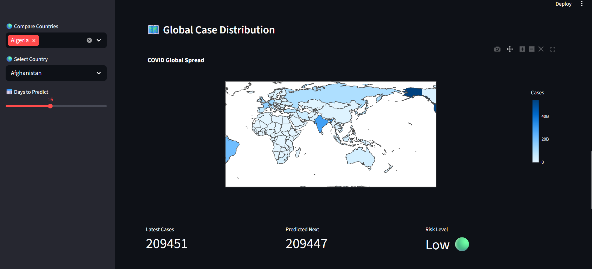

# 🧠 EpiVision AI – Smart Epidemic Prediction System

## 🚀 Overview
EpiVision AI is an advanced epidemic prediction system that leverages machine learning to forecast disease spread, analyze risk levels, and provide actionable health insights.

The platform transforms raw epidemiological data into meaningful predictions and visualizations, enabling better decision-making for public health and awareness.

---

## 🧠 Key Innovation
Unlike traditional prediction systems, EpiVision AI integrates:
- 📈 Predictive modeling
- 🔴 Risk level detection
- 🤖 AI-based health advisory
- 🌍 Multi-country comparison
- 🗺️ Geospatial visualization

This combination provides not just predictions, but actionable insights.

---
## 📸 Screenshots

### 🖥️ Dashboard



### 🌍 Comparison


### 📈 Graph
## AI prediction & past data


## Daily cases


### 🗺️ Map


## 🎯 Features
- 📊 AI-based future case prediction
- 🔴 Risk classification (High / Medium / Low)
- 🤖 Smart health recommendations
- 🌍 Multi-country comparison dashboard
- 🗺️ Global outbreak visualization (map)
- 📈 Model performance evaluation (MAE)
- 📉 Interactive data visualizations

---

## 🧪 Tech Stack
- Python
- Pandas, NumPy
- Scikit-learn (Random Forest)
- Streamlit
- Matplotlib & Plotly

---

## ⚙️ Installation & Setup

```bash
git clone https://github.com/Ronitmaurya53/EpiVision-AI-Epidemic-Prediction
cd EpiVision-AI-Epidemic-Prediction
pip install -r requirements.txt
streamlit run app.py
---
# If error comes, install manually
pip install streamlit pandas numpy matplotlib scikit-learn

## 🌟 Why This Project Stands Out
- Combines prediction with actionable insights
- Easy-to-use dashboard for non-technical users
- Focused on real-world healthcare impact.
